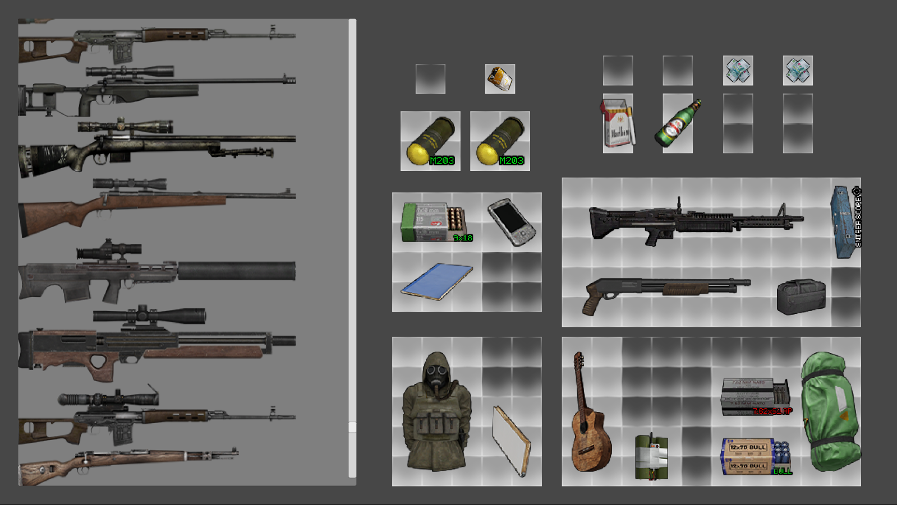

# Unity-Tile-Based-Inventory

## Description

Represents inventory system similar to DayZ, EFT, Diablo, PoE etc
This project is made for educational purposes.
The goal was to learn how the tile based inventory works and implement it.
The provided code has poor architecture and design.
If you plan to use this code, it is recommended to use it as an example, changing the architecture to your own!

**All rights to icons belong to their authors from [MODDB.com](https://www.moddb.com/mods/stalker-anomaly/addons/maids-vanilla-hd-icons)**

## Features
* Multi-inventory (drag-n-drop items between different inventories)
* Rotate items (Press R to rotate)

## Screenshots

